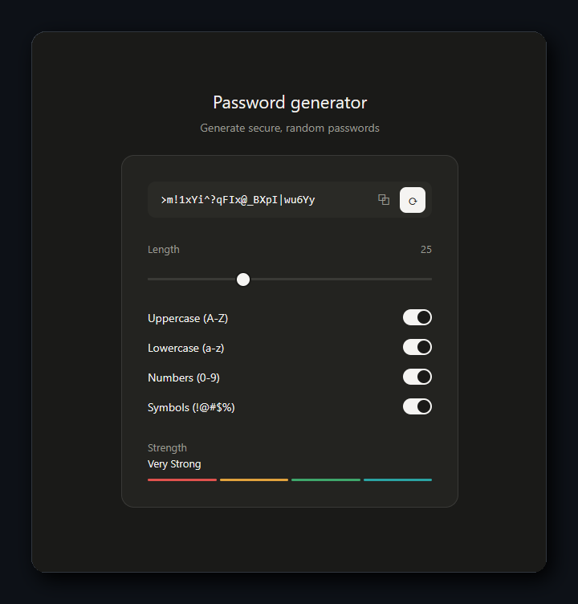

<h1 align="center">Gerador de Senhas</h1>

<p align="center">
  
  
  
</p>

<br/>

<p align="center">
  Gerador de senhas seguras direto no navegador, sem dependências e sem frameworks.<br/>
  Configure, gere e copie sua senha em segundos.
</p>

<br/>

<p align="center">
  
</p>

<br/>

---

**Funcionalidades**

- Senhas de até 64 caracteres
- Seleção de caracteres: letras maiúsculas, minúsculas, números e símbolos
- Medidor de força: fraca, média ou forte
- Botão para gerar nova senha
- Botão para copiar com um clique.

---

**Como rodar**

1. Clone o repositório
```bash
git clone https://github.com/cadu-ers/Gerador-de-Senhas.git
```
2. Abra a pasta no VS Code
3. Clique com o botão direito no `index.html` e selecione **Open with Live Server**

---
